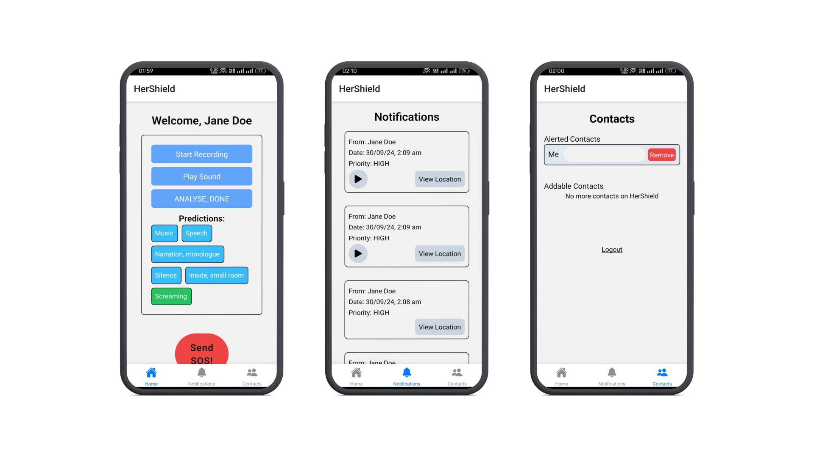

# Her Shield

An AI- Powered, Emergency alert application.

## Description

An AI-Powered Personal Safety application, that determines threats using audio analysis.

- **Audio Detection and Analysis:**
  - Utilizes a fine-tuned deep learning TensorFlow model to accurately classify and interpret background audio in real-time, and everything will happen on-device.
  - Implements advanced voice pitch analysis algorithms for precise gender classification, enhancing the ability to understand the context of potential threats.
  - Incorporates crowd estimation techniques to assess the surrounding environment and potential risk levels.
     
- **Intelligent Alerting System:**
  - Delivers rapid, high-priority notification alerts containing crucial audio snippets and precise location data to user-designated emergency contacts.
  - Employs a robust, fault-tolerant message queue system for SOS alerts, ensuring exceptionally high success rates in reaching contacts even under challenging network conditions.
  - Leverages auto-scaling worker infrastructure to efficiently manage and process large volumes of simultaneous SOS alerts, guaranteeing swift response times during critical situations.
  - Integrates seamlessly with local emergency services, providing them with detailed incident information for faster and more effective responses.

## Demo

